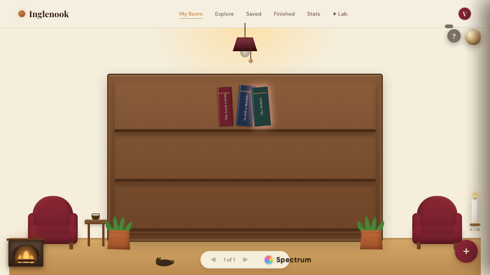
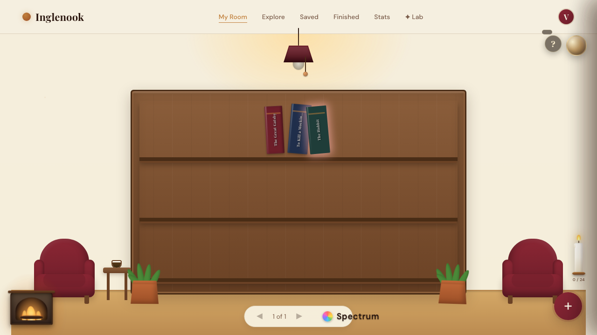
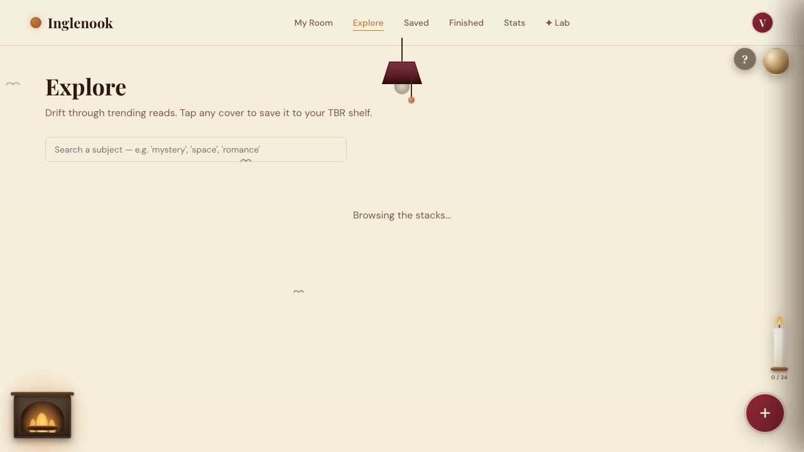

# 🏡 Inglenook: Your Cozy Illustrated Reading Room & Tracker

Welcome to **Inglenook**, a beautiful, local-first interactive reading room and book tracking application designed to make cataloging your library a cozy, tactile experience. 

Instead of dealing with boring tables and grids, Inglenook welcomes you into a virtual reading room. Everything is fully client-side and **local-first**—your books, reading goals, quotes, and history are saved directly in your browser's LocalStorage.

---

## 📸 Room & Feature Highlights

### 🌅 The Cozy Reading Room
An illustrated, interactive room that reflects your real-world library. Click the hanging lamp pull-string to transition from warm daylight into dark mode.

| ☀️ Daylight Room (Light Mode) | 🌙 Midnight Room (Dark Mode) |
| :---: | :---: |
|  |  |

---

### 🐈 Mr. Whiskers: The Interactive Cat Companion (Hidden Feature!)
Click the sleeping cat on the armchair to watch Mr. Whiskers wake up, crouch, leap onto the bookshelf, strut across it, swipe a book off, and jump back down to resume his nap.

| 🐈 Strutting on the Shelf | 💥 Swiping a Book Off |
| :---: | :---: |
|  |  |

---

### 📊 Library Analytics & Discovery
Explore curated lists, search for millions of books using the Open Library API, or check your reading statistics (genre donut charts, reading pace, page-count limits).

| 🔍 Explore & Add | 📈 Library Statistics |
| :---: | :---: |
|  |  |

---

## ✨ Cozy Interactive Mechanics & Easter Eggs

Inglenook is packed with hidden, interactive details:

* **🐈 Mr. Whiskers' Shelf Adventure:** Click the sleeping cat on the left armchair to trigger his shelf-climbing adventure. The book he knocks off falls to the floor with custom physics and bounces!
* **💡 Pull-String Lamp:** A fully interactive pull-string hanging brass lamp that dims the room and toggles light/dark themes.
* **☕ Tea Cup Pomodoro:** Click the steaming tea cup sitting next to your reading chair to start a 25-minute reading timer.
* **🌦️ Geolocation Weather Sync:** Connects to the [Open-Meteo API](https://open-meteo.com/) (privacy-friendly, no keys required) to match the view outside your window with your actual local weather (rain, snow, clouds, or sun).
* **🌿 Seasonal Plant:** The potted plant near the fireplace adjusts its appearance dynamically based on the current season of the year in your region.
* **👣 Footsteps Heatmap:** The more books you read and update, the more footstep patterns begin to lightly burn into the wooden floorboards, indicating your path through the room.
* **📚 Book Spine Physics:** Book spines on the shelf scale dynamically based on the page counts of the books. Heavier volumes look thicker and taller!
* **🕸️ Forgotten Cobwebs:** If you go a long time without reading or cataloging books, spiderwebs will slowly begin to spin in the upper corners of your bookshelves.
* **🏆 Book Tournament:** Pit your favorite books against one another in a head-to-head bracket tournament to crown your ultimate read of the year.
* **🪦 The Book Graveyard:** Deleted books are sent to the "Graveyard of the Unfinished" with custom epitaphs.
* **🌌 Constellation Map:** Maps your favorite genres to stars and constellations in the night sky.
* **🧬 Reading DNA Helix:** Visualizes your reading logs as a custom double-helix gene map.
* **🌕 Haunted Moon Mode:** During a real-world full moon, the window turns spooky and the cat's eyes glow crimson.
* **⌨️ Keyboard Mode:** Support for keyboard shortcuts (including Vim bindings) for mouse-free navigation.

---

## 🛠️ Architecture & Tech Stack

* **Structure:** Semantic HTML5 layout.
* **Design & Styling:** Custom CSS3 with custom variables, smooth transitions, custom scrollbars, and a warm, bookish design system. An SVG noise-filter paper overlay is applied across the room to give the graphics a rich, tactile texture.
* **Logic & State:** Pure ES6+ JavaScript. The entire application runs client-side with states stored in browser `localStorage`.
* **APIs & Libraries:**
  * **[Open Library API](https://openlibrary.org/developers/api)** for rich book searches and cover metadata.
  * **[Open-Meteo API](https://open-meteo.com/)** for live weather conditions.
* **E2E Testing:** Playwright test suite for multi-browser and UI automation tests.

---

## 🚀 Quick Start

Since Inglenook has no backend server dependencies, you can open and run it directly in your browser:

1. Double-click `inglenook.html` in your file explorer.
2. (Optional but recommended) Run a local server to avoid CORS limitations with external cover assets:
   ```bash
   npm install
   npx serve .
   ```

---

## 🧪 Tests

To run the automated E2E test suite (which includes tests for the room rendering, panel animations, navigation views, and stats):

```bash
# Install browsers
npx playwright install

# Run all tests
npx playwright test tests/full_test.spec.js --reporter=list
```
