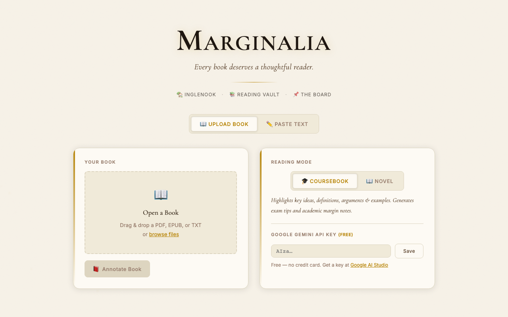
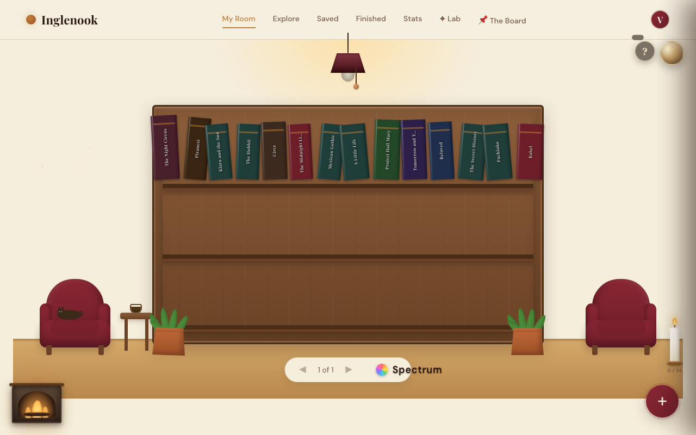
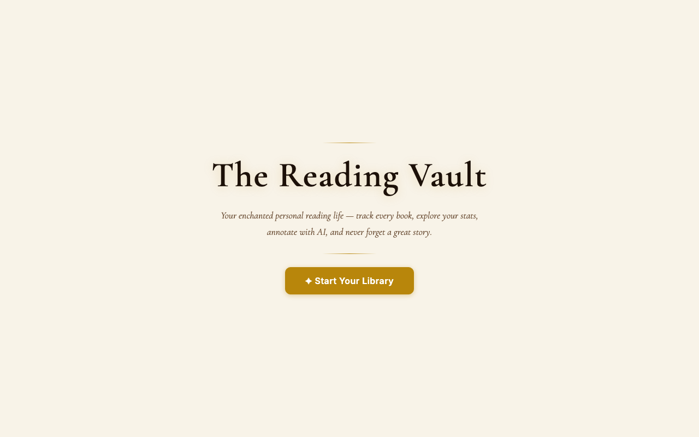
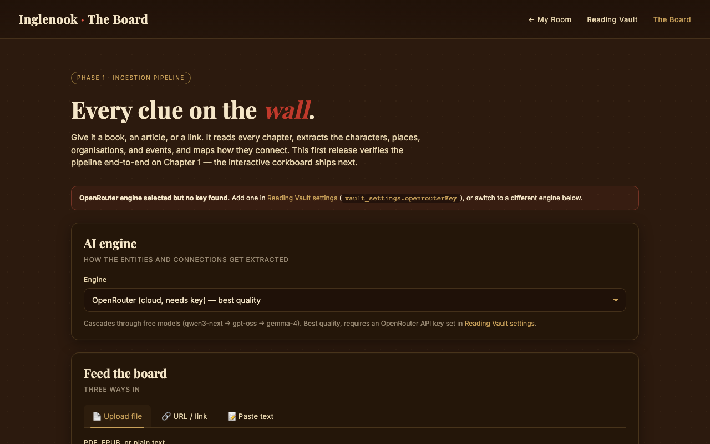

# Inglenook: Cozy Illustrated Reading Room & Tracker

> A beautiful, local-first interactive reading room and book tracking application designed to make cataloging your library a cozy, tactile experience.

---

## Overview

**Inglenook** welcomes you into a virtual, illustrated reading room. Instead of boring tables and spreadsheets, your reading progress, goals, quotes, and history are visualized directly inside a cozy room layout. Everything runs 100% client-side and **local-first**—your library data is persisted securely in your browser's LocalStorage.

---

## Features

- **🌅 Cozy Reading Room**: An illustrated, interactive room reflecting your library. Click the hanging lamp pull-string to dim the room and toggle light/dark themes.
- **🐈 Mr. Whiskers (Interactive Companion)**: Click the sleeping cat on the armchair to watch him climb the shelf, strut, and playfully knock a book off with realistic bouncing physics.
- **📊 Library Analytics & Discovery**: Explore curated lists, search using the Open Library API, and view statistics (genre donut charts, reading pace, page-count limits).
- **☕ Tea Cup Pomodoro**: Click the steaming tea cup sitting next to your reading chair to start a 25-minute reading timer.
- **🌦️ Geolocation Weather Sync**: Uses open meteo coordinates to sync the view outside the reading room window with your real-world local weather (rain, snow, clouds, or sun).
- **🌿 Seasonal Plant & Forgotten Cobwebs**: Potted plant near the fireplace changes based on the season. If you neglect your library, spiderwebs slowly spin in the bookshelf corners!
- **🏆 Book Tournament**: Pit your favorite books against one another in a head-to-head bracket tournament.
- **🪦 The Book Graveyard**: Deleted books are sent to the "Graveyard of the Unfinished" with custom epitaphs.

---

## Tech Stack

- **Languages**: HTML5, CSS3, JavaScript (ES6+)
- **APIs**:
  - **Open Library API** (Book metadata & covers)
  - **Open-Meteo API** (Privacy-friendly local weather sync)
- **Libraries**:
  - **Compromise.js** (NLP-based book quote parsing)
- **Testing**:
  - **Playwright** (End-to-End browser test suite)

---

## Architecture

Inglenook is structured as a modular static application:
- **State Management**: LocalStorage handles all library database states, reading pace, and custom settings.
- **Dynamic CSS variables**: Controls day/night shading, weather layers, and animations (such as the cat adventure or book spine scaling).
- **Cover Proxying**: Integrates Open Library cover IDs for responsive cover rendering.

---

## Folder Structure

```text
Annotator/
├── assets/
│   ├── screenshots/       # App screenshots
│   │   ├── home.png
│   │   ├── inglenook.png
│   │   ├── reading-vault.png
│   │   └── board.png
│   ├── cat_knocking_book.png
│   ├── cat_walking_on_shelf.png
│   ├── inglenook_dark.png
│   ├── inglenook_explore.png
│   ├── inglenook_room.png
│   ├── inglenook_stats.png
│   └── inglenook_tbr.png
├── index.html             # Room and shell landing page
├── inglenook.html         # Book catalog and analytics dashboard
├── reading-vault.html     # Vault view of read books
├── board.html             # Interactive text editor and NLP quote extractor
├── package.json
├── playwright.config.js
└── tests/                 # Automated test suite
```

---

## Installation

### Prerequisites

No server setup is required. To install dependencies for testing or local serving:

```bash
cd Annotator
npm install
```

---

## Running the Project

### Static Opening

Since Inglenook is backend-free, you can open and run it directly in your browser:
Double-click `index.html` inside your file browser.

### Local Server Serving (Recommended)

To avoid CORS restrictions on external cover assets:
```bash
npx http-server -p 8080
```
Then navigate to [http://localhost:8080](http://localhost:8080).

---

## Screenshots

### Coziest Reading Room (Home)


### Library Catalogue (Inglenook)


### Reading Vault


### NLP Quote Extractor & Board


---

## Workflow

1. **Enter Room**: Toggle the brass lamp string to choose your ambiance. Start the tea Pomodoro timer.
2. **Search & Catalog**: Go to the **Inglenook** dashboard, search for your favorite book, and add it to your TBR or Currently Reading shelf.
3. **Log Progress**: Click on your shelf, update read page counts, and watch the wooden floor footprint heatmap darken.
4. **Extract Quotes**: Go to **Board**, upload text or paste chapters to extract quotes using NLP, and pin them to your vault board.

---

## Future Improvements

- [ ] Support custom shelf styling and shelf categories.
- [ ] Add CSV export/import for GoodReads integration.
- [ ] Add sound effects (fireplace crackling, rain tapping).

---

## Author

- **GitHub Profile**: [Vaishnavi Dubey](https://github.com/Vaishnavi-Dubey)

---

## License

This project is licensed under the MIT License.
