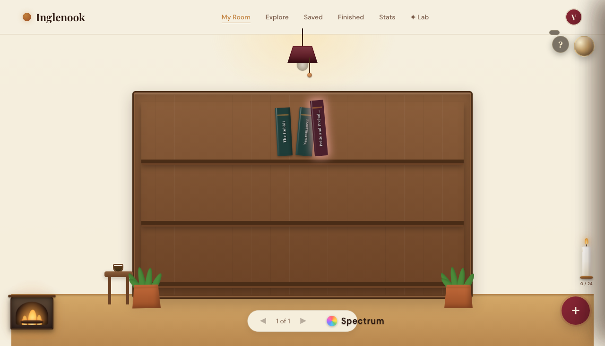
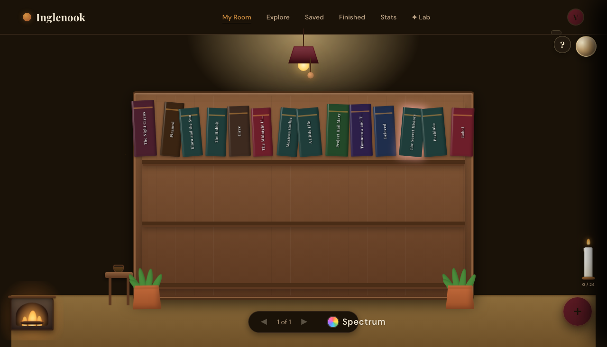
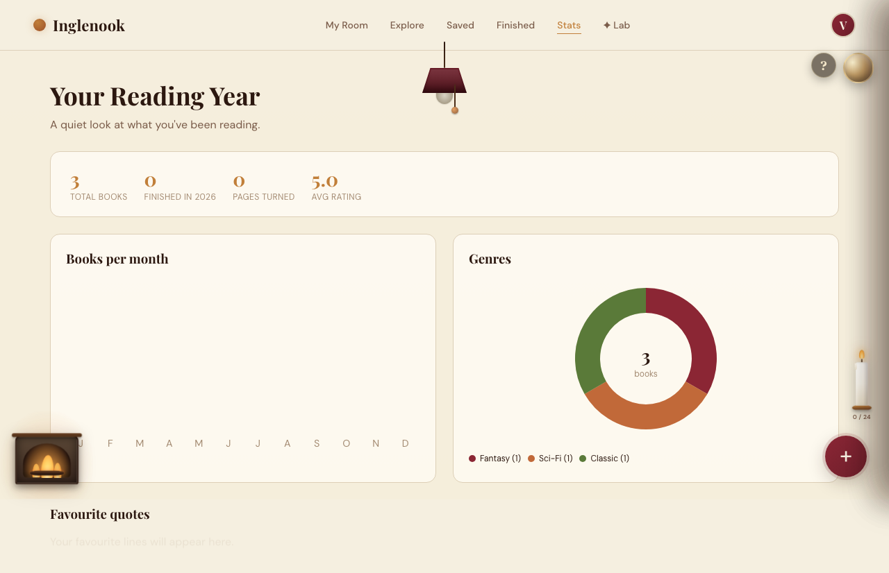
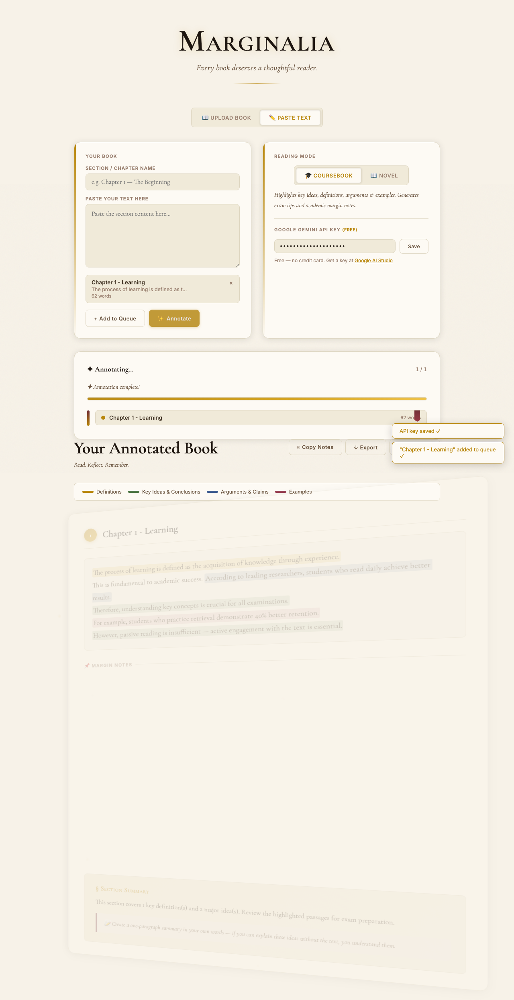
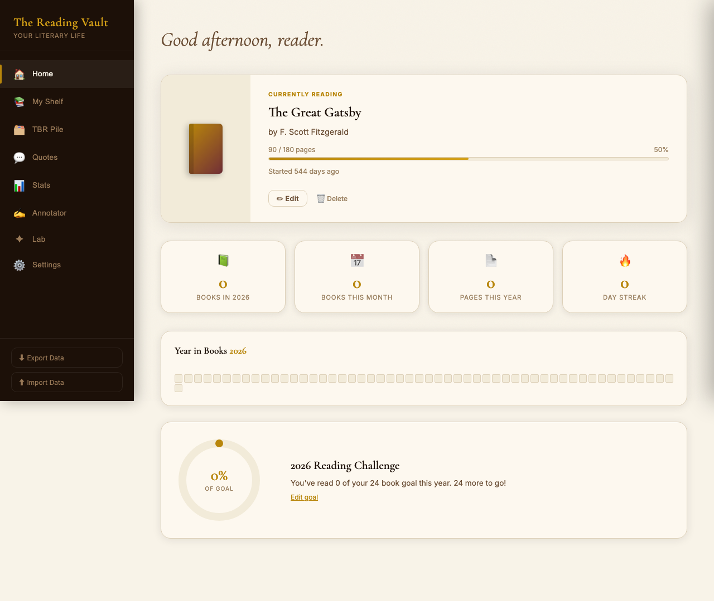
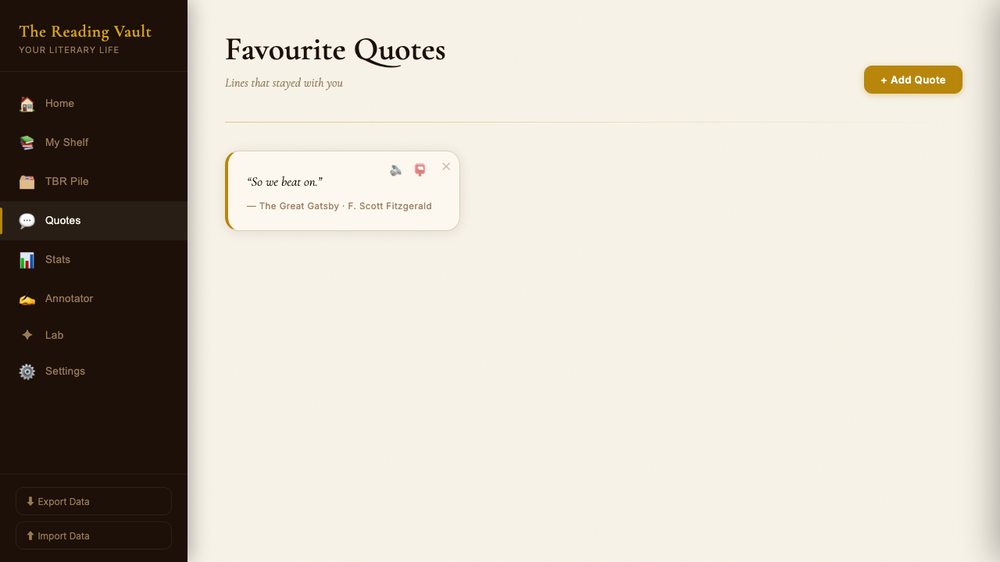
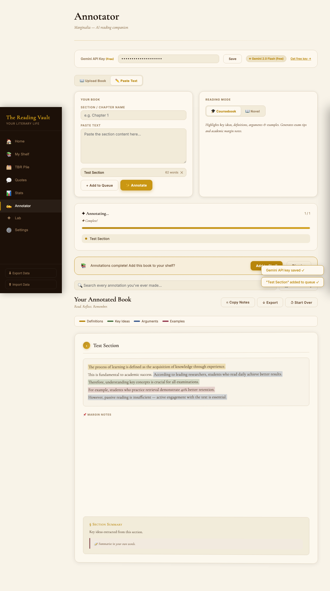
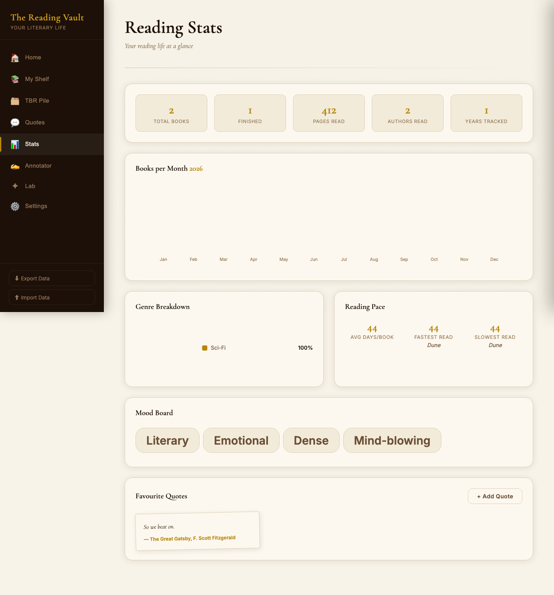

# 📚 Inglenook & Marginalia: The Cozy AI Reading Suite

Welcome to **Inglenook**, a beautiful, local-first reading suite for book lovers. It combines a cozy, interactive illustrated reading room with **Marginalia**—an AI-powered margin notes annotator—and a unified **Reading Vault** dashboard to capture, catalog, and enrich your reading life.

Everything runs entirely in your browser. With **local-first privacy**, your books, favorite quotes, reading statistics, and API keys are stored securely in your browser's local storage—no tracking, no cloud databases, no logins required.

---

## 🎨 Inside the Suite

### 1. Inglenook — Your Cozy Illustrated Reading Room (`inglenook.html`)
*Escape into a quiet library. Catalog your books and watch your library grow.*
* **Cozy Interactive Library UI:** Displays an illustrated reading room with bookshelf styling, a book detail drawer, and animated transitions.
* **Pull-String Lamp Theme Toggle:** Click the hanging lamp pull-string to dim the lights and transition between a warm parchment-light mode and a rich espresso-dark mode.
* **Open Library Lookup:** Search millions of books by title, author, or ISBN to instantly fetch covers, pages, and metadata.
* **Smart Recommendations:** Explore curated bookshelves and dynamic search categories.
* **Reading Stats & Charts:** Beautifully rendered local charts tracking your finished books, total pages read, genre breakdown, and daily progress.

#### 📸 Room Visuals
| 🌅 The Reading Room (Light Mode) | 🌌 The Reading Room (Dark Mode) |
| :---: | :---: |
|  |  |

| 📊 Library Analytics & Charts |
| :---: |
|  |

---

### 2. Marginalia — AI Book Annotator (`index.html`)
*Annotate your books with a personal AI scholar that writes directly in the margins.*
* **PDF & Text Uploads:** Drag-and-drop PDF books or paste chapters directly into the reader.
* **AI Margin Scribbles:** Send text sections to Gemini, OpenRouter, or OpenAI to generate contextual annotations, character analysis, historical context, or vocabulary definitions directly in the margins.
* **Tactile Highlight Tools:** Highlight text passages with multiple ink-like highlighter colors (burgundy, gold, sage, blue).
* **Export Options:** Instantly export your annotated text and margin notes as standard Markdown (`.md`) files.

#### 📸 Marginalia Workspace
| ✍️ AI Annotation Layout |
| :---: |
|  |

---

### 3. The Reading Vault — Unified Dashboard (`reading-vault.html`)
*The central dashboard combining tracking, quotes, goals, and annotations.*
* **Comprehensive Bookshelf:** Track books across "Currently Reading", "TBR" (To Be Read), and "Finished" categories.
* **Interactive Quotes Wall:** Pin your favorite quotes from books with page numbers, tags, and authors.
* **Daily & Yearly Reading Goals:** Dynamic progress meters tracking your reading habits against customizable goals.
* **Backup & Portability:** Import and export your entire vault as a single `.json` file to migrate between devices.

#### 📸 Vault Visuals
| 🏠 Home Dashboard | 💬 Interactive Quotes Wall |
| :---: | :---: |
|  |  |

| 🧠 AI Annotation Center | 📊 Vault Stats Dashboard |
| :---: | :---: |
|  |  |

---

## 🛠️ Architecture & Tech Stack

* **Frontend Layout:** Responsive Semantic HTML5, CSS Grid, and custom CSS Flexbox layouts.
* **Visual Styling:** 
  * Custom CSS variables for quick styling and full support for `prefers-color-scheme`.
  * Tactile SVG noise-filter paper overlay to simulate authentic paper grains.
  * Custom bezier transitions for drawers, modals, and panel slides.
* **State & Storage:** Vanilla ES6+ JavaScript. State management is bound directly to `localStorage`.
* **Libraries & APIs:**
  * **[PDF.js](https://mozilla.github.io/pdf.js/)** (Mozilla) for client-side PDF document parsing and text extracting.
  * **[Open Library API](https://openlibrary.org/developers/api)** for live metadata searches.
  * **LLM API Integrations** for local AI-based annotations (Gemini, OpenRouter, OpenAI).
* **Testing Suite:** Playwright E2E testing framework for multi-browser validation.

---

## 🚀 Run Locally

Since this is a client-side application, you can run it directly:

### 1. Direct Browser Open
Just open any of the HTML pages in your browser:
* `inglenook.html` (Reading Room & Tracker)
* `reading-vault.html` (Vault & Stats)
* `index.html` (Marginalia Reader)

### 2. Local HTTP Server (Recommended)
Starting a local server prevents CORS/security blocks when handling uploaded PDFs.
```bash
# Clone the repository
git clone https://github.com/Vaishnavi-Dubey/inglenook.git
cd inglenook

# Install dev dependencies
npm install

# Start a simple HTTP server
npx serve .
```

---

## 🧪 Running E2E & Visual Tests

We maintain a rigorous suite of **60 E2E and visual validation tests** using Playwright.

```bash
# Install browsers
npx playwright install

# Run the test suite
npx playwright test

# View test report
npx playwright show-report
```
